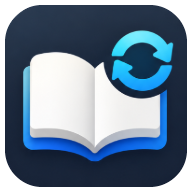

[English](README.en.md) · **한국어**

<div align="center">



# FloNovel for Android

**내 스마트폰 폴더의 텍스트 소설을 읽고, PC와 실시간 이어 읽는 모바일 리더**

[](https://developer.android.com)
[](https://developer.android.com/jetpack/compose)
[](https://developer.android.com/training/data-storage/room)
[](../LICENSE)

[🌐 전체 프로젝트 안내](../README.md) · [🖥️ Desktop 앱](../FloNovel-desktop/README.md) · [💬 이슈 제보](https://github.com/katalog/FloNovel/issues)

</div>

---

## ✨ 핵심 기능

### 🗂️ 서재와 스마트 파일 탐색
- 📁 **SAF 완벽 연동:** Storage Access Framework(SAF)를 통해 기기 내 폴더를 자유롭게 선택하고 상위/하위 폴더를 빵가루(Breadcrumb) 경로로 부드럽게 탐색합니다.
- 📦 **ZIP 압축 직독:** `.txt`는 물론 ZIP 파일 내부의 텍스트 소설을 **디스크에 풀지 않고 즉시 열람**합니다.
- 🗃️ **서재 정리:** 이름·날짜·크기별 오름차순/내림차순 정렬, 책별 진행률 퍼센트 표시, 앱 시작 시 마지막 읽던 책 이어 읽기 팝업.
- 🗑️ **안전한 관리:** 파일·폴더 길게 누르기로 삭제 가능하며, 동기화된 책의 로컬 삭제는 클라우드 휴지통 정책에 따라 안전하게 처리됩니다.
- 🔤 **스마트 인코딩 판별:** UTF-8은 물론 국내 텍스트 소설에 흔한 EUC-KR / CP949 / MS949 인코딩을 자동으로 식별합니다.

---

### 📖 뷰어 화면 및 제스처 조작
- 📄 **뷰어 모드:** 좌우 페이지 넘김 모드 또는 부드러운 세로 연속 스크롤 모드 지원 (전환 효과: 없음 / 슬라이드 / 덮기).
- 🎮 **3×3 맞춤 그리드 & 제스처:**
  - **표준 3분할:** 왼쪽(이전 페이지) / 가운데(도구 모음 토글) / 오른쪽(다음 페이지)
  - **3×3 터치 그리드:** 화면을 9개 영역으로 나누어 각 칸마다 원하는 액션(페이지 넘김, 챕터 이동, 점프 등)을 자유롭게 할당.
  - **스와이프 & 볼륨 키:** 가로/세로 스와이프 액션 지정 및 물리 볼륨 키 페이지 넘김 지원.
- 📑 **정밀 탐색:** 자동 탐지된 목차 목록, 정규식 기반 챕터 패턴 프리셋 및 커스텀 정규식 추가, 본문 고속 검색.
- 🎯 **오프셋 앵커:** 글자 크기나 화면 방향이 바뀌어도 문장이 밀리지 않는 본문 문자 오프셋(Char Offset) 기반 위치 보존.

```text
┌────────────────────────────────────────┐
│             3×3 그리드 터치 영역        │
├──────────────┬──────────────┬──────────┤
│  이전 페이지  │  도구 모음    │ 다음 페이지│
├──────────────┼──────────────┼──────────┤
│  이전 챕터   │  다음 페이지  │ 다음 페이지│
├──────────────┼──────────────┼──────────┤
│  이전 점프   │  다음 페이지  │ 다음 챕터  │
└──────────────┴──────────────┴──────────┘
```

---

### 🎨 독서 환경 커스터마이징
- 🌈 **6가지 감성 테마:** 웜 아이보리, 세피아 크림, 다크 네이비, 소프트 그레이, 쿨 라이트, 소프트 다크 브라운.
- 🎛️ **정밀 타이포그래피:** 글자 크기(sp), 줄 간격 배율, 자간, 상하좌우 여백을 슬라이더로 미세 조정.
- 🔤 **무료 한글 폰트 원클릭 다운로드:** 나눔고딕, 나눔명조, Noto Sans KR, 리디바탕, Pretendard 내장 다운로더 제공.
- ⏱️ **타이머 자동 넘김:** 손을 쓰지 않고 편하게 읽을 수 있도록 지정한 초(초 단위 스텝)마다 자동으로 페이지를 넘김.
- ☀️ **화면 제어:** 앱 자체 밝기 오버라이드, 화면 방향(자동/세로/가로 고정), 독서 중 화면 꺼짐 방지.

---

## ⚡ 텍스트 전처리 (Text Preprocessing)

로컬의 원시 `.txt` 소설은 처음 열거나 업로드하기 전에 자동으로 가독성이 개선됩니다. **첫 처리 시 원본은 책 폴더 내 `.flonovel/original/`에 안전하게 백업됩니다.**

- 줄바꿈 통일(`\n`), 문단 앞 불필요한 공백·탭 정리, 3연속 이상 빈 줄 축소.
- 가독성을 해치는 인접 중복 내용 줄(도배 줄 등) 자동 제거.
- 탐지된 챕터 제목에 `##` 마크다운 스타일 표식 및 시작/끝 마커 부여.
- 파일명 길이 정규화(최대 50자) 및 불필요한 특수문자/한자 정리.
- *전처리는 멱등(Idempotent)하여 이미 처리된 책은 다시 가공하지 않으며, 데스크톱 버전과 100% 동일한 바이트 출력을 보장합니다.*

---

## ☁️ 양방향 동기화

상세 설정법은 [전체 프로젝트 동기화 안내](../README.md#동기화-설정-선택)를 참고하세요.

- 📦 **Dropbox 파일 동기화:** 데스크톱의 `/books` 폴더와 양방향 동기화 (추가·수정·삭제·이동 실시간 반영).
- ⚡ **Supabase 위치 동기화:** PC에서 읽던 위치가 더 앞서 있으면 "PC에서 읽던 위치로 이동하시겠습니까?" 제안 팝업 노출.
- 🛡️ **안전 장치:** 충돌 발생 시 원격본과 `(충돌 사본 - Android - 날짜)`로 분기 보존하며, 대량 삭제 발생 시 사용자 승인 요청.

---

## 📱 빌드 및 설치 가이드

### 개발 환경 요구 사항
- **JDK 17 이상**
- **Android SDK Platform 36** (Build Tools 36)
- 지원 기기: **Android 7.0 (API 레벨 24) 이상**

### 로컬 빌드 명령어
저장소 루트에서:

```bash
cd FloNovel-android

# 단위 테스트 실행 및 Debug APK 빌드
./gradlew testDebugUnitTest assembleDebug

# 연결된 Android 기기/에뮬레이터에 즉시 설치
./gradlew installDebug
```
*(Windows PowerShell 환경에서는 `.\gradlew.bat`를 사용합니다.)*

- 디버그 빌드의 Application ID는 `com.moonkata.flonovel.android.dev`로 격리되어 정식 버전과 충돌 없이 공존합니다.

---

## 🧪 테스트 및 아키텍처

```bash
cd FloNovel-android
./gradlew testDebugUnitTest          # JVM 단위 테스트 (빠른 게이트)
./gradlew compileDebugAndroidTestKotlin # 계측 테스트 컴파일 검증
```

- **클린 아키텍처:**
  - `ui/`: Jetpack Compose 기반 화면(Library, Reader) 및 MVI 패턴 ViewModel.
  - `data/`: Room Database, DataStore Preferences, SAF 연동 파일 시스템, 인코딩 감지기, 텍스트 전처리기.
  - `tts/`: 타이머 기반 자동 페이지 넘김 컨트롤러 (`AutoPageTurnController`).

---

## 📄 라이선스

이 프로젝트는 [Apache License 2.0](../LICENSE) 하에 배포됩니다.
