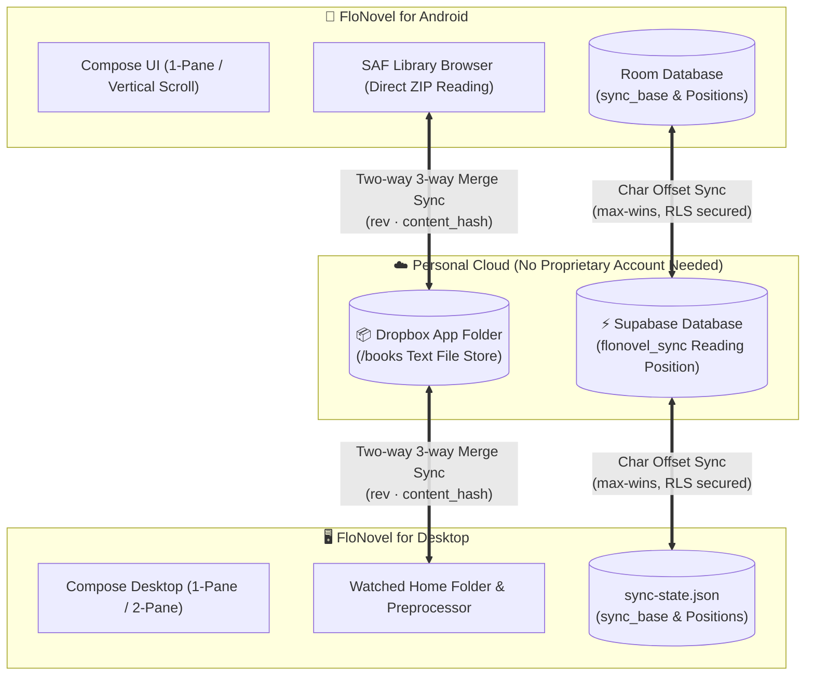

**English** · [한국어](README.md)

<div align="center">


# FloNovel

**An open-source text novel reader to seamlessly continue reading between Android and PC**

[](https://kotlinlang.org)
[](FloNovel-android/README.en.md)
[](FloNovel-desktop/README.en.md)
[](https://www.jetbrains.com/lp/compose-multiplatform/)
[](https://www.dropbox.com)
[](https://supabase.com)
[](LICENSE)

[📱 Android Guide](FloNovel-android/README.en.md) · [🖥️ Desktop Guide](FloNovel-desktop/README.en.md) · [💬 Issues](https://github.com/katalog/FloNovel/issues)

</div>

---

**FloNovel** consists of two standalone reader applications (Android & Desktop) crafted for `.txt` novels.
It navigates your directory structure directly, cleans up inconsistent formatting, and automatically detects chapters to build a dynamic table of contents.

Reading progress is saved as the **decoded character offset** in the text rather than an arbitrary page number. Even when changing font family, text size, window dimensions, or layout modes (1-pane vs 2-pane), FloNovel **accurately restores your exact reading sentence**.

Local reading works 100% offline without any account. When desired, **book files sync via Dropbox** and **reading positions sync via Supabase** — without requiring a proprietary FloNovel account.

---

## 🔄 Architecture & Synchronization Flow

The two applications do not share code, but adhere strictly to a shared synchronization contract.



---

## ✨ Features

### 🌐 Shared Core Experience

- 📖 **Text Engine:** Auto-detects UTF-8 and EUC-KR / CP949 / MS949 encodings with robust rendering for large texts.
- 📑 **Smart Table of Contents:** Automatic chapter detection, regex patterns, custom patterns, and full-text search.
- 🎯 **Precise Progress Tracking:** Anchor stored as character offsets; prompts you to jump forward when a further reading position is detected on another device.
- 🎨 **Comfortable Reading Screen:** 6 color presets (Warm Ivory, Sepia, Dark Navy, etc.), font family/size, line height, letter spacing, margins, and downloadable Korean free fonts (Nanum, RIDIBatang, Pretendard).
- ⚡ **Idempotent Text Preprocessing:** Cleans whitespace, line breaks, indentations, duplicate lines, inserts `##` chapter markers, normalizes filenames, and creates automatic backups before alteration.
- 🔄 **Safe Two-Way Sync:** 3-way comparison (Local ↔ Base ↔ Remote) supporting adds, edits, deletes, moves, and renames with conflict preservation and mass-deletion guardrails.
- 🌏 **Bilingual UI:** Clean Korean and English localization.

---

### 📱 Android Highlights

- **Viewer Modes:** Horizontal page turns or smooth continuous vertical scrolling.
- **Versatile Gestures:** Standard 3-column touch zones, customizable **3×3 grid**, directional swipes, and volume-key paging.
- **Timed Auto-Advance:** Timer mode that automatically flips pages at a configured interval.
- **Smart File Browsing:** Storage Access Framework (SAF) integration; read `.txt` inside ZIP archives without extracting to disk.
- **Display Controls:** Custom background/text colors, brightness override, orientation lock (portrait/landscape), and keep-screen-on.

👉 [View Android Guide & Usage →](FloNovel-android/README.en.md)

---

### 🖥️ Desktop Highlights

- **Viewer Modes:** Designed for widescreen monitors with **1-pane or 2-pane (spread) view**.
  - In 2-pane mode, navigation advances by half the visible content (1 pane), seamlessly moving the right pane to the left.
- **Keyboard-First Controls:** Full key remapping, smooth page transition animations, and mouse wheel navigation.
- **Home Folder Automation:** Watched directory with auto-preprocessing on new files, and chapter detection report tooling.
- **Layout Customization:** Text column width, pane gap/ratio, font weight, and UI scale adjustments.
- **Extras:** Built-in 20-20-20 eye strain reminder, and integrated MP3/AAC internet radio with a sleep timer.

👉 [View Desktop Guide & Shortcuts →](FloNovel-desktop/README.en.md)

---

## 🚀 Quick Start

1. Follow the build instructions below for your platform.
2. **Add a Book Folder:**
   - **Android:** Tap **Add folder** to pick your novel directory.
   - **Desktop:** Click **Set home folder** to choose your novel library.
3. Open a novel and start reading! (Tap center to toggle controls on Android, press `F4` for settings on Desktop).
4. Follow the **Sync Setup** below to continue reading across mobile and desktop.

> ⚠️ **Note on Text Preprocessing:** Preprocessing cleans text to ensure optimal readability. On initial run, original files are backed up to `.flonovel/original/` inside your library directory.

---

## 📦 Installation & Source Builds

Both apps build directly from source. Requires **JDK 17+**.

```bash
git clone https://github.com/katalog/FloNovel.git
cd FloNovel
```

### 📱 Android Build
Requires Android SDK Platform 36 and build tools.

```bash
cd FloNovel-android
./gradlew testDebugUnitTest assembleDebug
```
- APK output: `FloNovel-android/app/build/outputs/apk/debug/app-debug.apk` (Supports Android 7.0+)

### 🖥️ Desktop Build & Run
From the repository root in a separate terminal:

```bash
cd FloNovel-desktop
./gradlew test run
```
- On Windows PowerShell, use `.\gradlew.bat`.
- To package desktop installers (MSI/DMG/DEB), refer to the [Desktop Guide](FloNovel-desktop/README.en.md#packaging).

---

## ☁️ Optional Synchronization Setup

### 1. Two-Way File Sync: Dropbox
Both apps must point to the **same Dropbox App Key and account**.

1. Create a **Scoped access** / **App folder** app in the [Dropbox Developers Console](https://www.dropbox.com/developers/apps).
2. Enable permissions: `account_info.read`, `files.metadata.read`, `files.metadata.write`, `files.content.read`, `files.content.write`.
3. Add Desktop Redirect URI: `http://localhost:52475/oauth/callback`.
4. Copy `local.properties.example` to `local.properties` in each app folder, insert your `DROPBOX_APP_KEY`, and build.
5. In the app library, connect Dropbox and start the first sync.

- The shared root is `/books` in your Dropbox App folder.
- Conflicts preserve both copies with `(conflicted copy - PC/Android - Date)` naming.
- Mass-deletion safeguard prompts for confirmation if 20+ files or 30%+ of the library would be deleted.

### 2. Reading Position Sync: Supabase
To sync reading offsets alongside book files, configure `SUPABASE_URL` and `SUPABASE_PUBLISHABLE_KEY`.

- **Link Desktop first**: Desktop generates `/.flonovel/secret.json` in Dropbox, which Android reads on setup.
- The server trigger enforces `greatest(new, old)` max-wins logic to prevent offset regressions.
- For complete SQL schema and protocol specifications, see [AGENTS.md §1](AGENTS.md#1-계약--하나라도-어기면-반대편-앱이-조용히-깨진다).

---

## 📋 Compatibility Matrix

| Category | Android | Desktop |
|---|---|---|
| **Supported Formats** | `.txt`, ZIP containing `.txt` | `.txt` (EPUB/PDF/MOBI unsupported) |
| **Requirements** | Android 7.0 (API 24) or higher | Windows 10+, macOS 11+, Linux |
| **Encodings** | Auto-detect UTF-8, EUC-KR / CP949 / MS949 | Same |
| **Network** | 100% offline reading (Network only for sync & font downloads) | Same |

---

## 🛠️ Development & Contributing

```text
FloNovel-android/   Android App (Kotlin · Compose · Room · DataStore)
FloNovel-desktop/   Desktop App (Kotlin/JVM · Compose Desktop)
.github/workflows/  GitHub Actions Release Workflows
```

- **[AGENTS.md](AGENTS.md)** is the single source of truth for all agents and contributors. Please read it before making changes.
- Preprocessor changes must preserve byte-for-byte parity across both platforms (`parity fixtures`).
- Test gates:
  - Android: `cd FloNovel-android && ./gradlew testDebugUnitTest`
  - Desktop: `cd FloNovel-desktop && ./gradlew test`

---

## 📄 License

Distributed under the [Apache License 2.0](LICENSE).
Included and downloadable fonts remain under their respective open font licenses (OFL, etc.).
