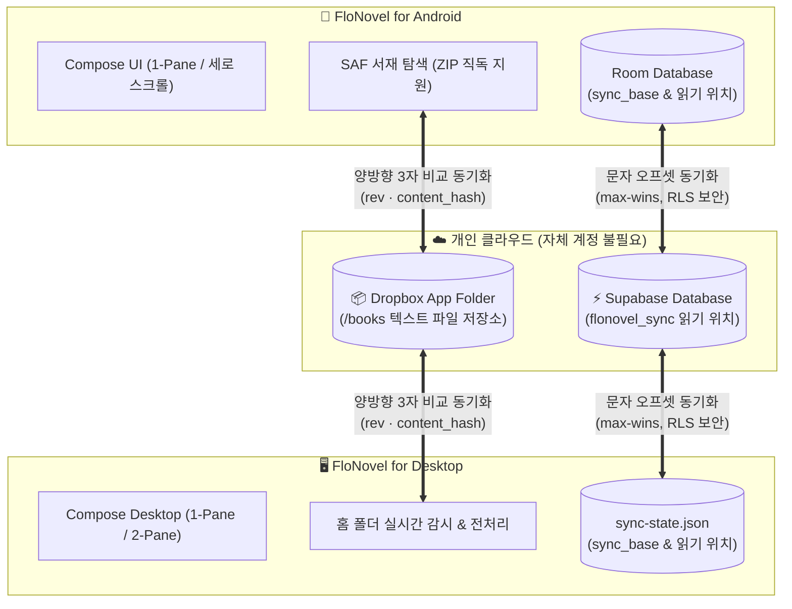

[English](README.en.md) · **한국어**

<div align="center">


# FloNovel

**내가 가진 텍스트 소설을 Android와 PC에서 이어 읽는 오픈소스 리더**

[](https://kotlinlang.org)
[](FloNovel-android/README.md)
[](FloNovel-desktop/README.md)
[](https://www.jetbrains.com/lp/compose-multiplatform/)
[](https://www.dropbox.com)
[](https://supabase.com)
[](LICENSE)

[📱 Android 안내](FloNovel-android/README.md) · [🖥️ Desktop 안내](FloNovel-desktop/README.md) · [💬 이슈 제보](https://github.com/katalog/FloNovel/issues)

</div>

---

**FloNovel**은 `.txt` 소설을 위한 두 개의 독립형 리더 앱(Android · Desktop)입니다.
폴더 구조를 그대로 탐색하고, 텍스트 서식을 깔끔하게 정리하며, 챕터를 자동으로 탐지해 목차를 만듭니다.

읽기 위치를 페이지 번호가 아닌 **본문의 디코딩된 문자 오프셋(Character Offset)**으로 저장하므로, 기기마다 다른 글꼴·창 크기·화면 모드(1-pane / 2-pane)를 사용하더라도 **오차 없이 정확하게 읽던 문장 위치를 복원**합니다.

로컬 독서는 인터넷 없이 완전 오프라인으로 사용할 수 있으며, 필요할 때 **Dropbox에 책 파일**, **Supabase에 읽기 위치**를 선택적으로 동기화합니다. 별도의 FloNovel 서비스 계정을 가입할 필요가 없습니다.

---

## 🔄 시스템 구조 및 동기화 흐름

FloNovel은 두 앱이 코드를 공유하지 않으면서도 엄격한 계약(Contract)에 합의하여 완벽하게 호환됩니다.



---

## ✨ 주요 기능

### 🌐 두 앱 공통 핵심 경험

- 📖 **텍스트 엔진:** UTF-8 및 EUC-KR / CP949 계열 인코딩 자동 판별, 대용량 텍스트 안정적 렌더링.
- 📑 **스마트 목차와 이동:** 챕터 자동 탐지, 패턴 프리셋 및 사용자 지정 정규식, 본문 통합 검색.
- 🎯 **정밀한 읽기 위치 보존:** 글꼴 크기나 창 크기에 구애받지 않는 본문 문자 오프셋 기반 위치 저장, 상대 기기의 더 앞선 위치 발견 시 이동 제안.
- 🎨 **쾌적한 독서 화면:** 6가지 프리셋 테마(웜 아이보리, 세피아, 다크 네이비 등), 글꼴·크기·줄 간격·자간·여백 조절, 한글 무료 폰트 다운로드(나눔, 리디바탕, Pretendard 등).
- ⚡ **텍스트 전처리 (멱등성 보장):** 줄바꿈·들여쓰기·빈 줄 정리, 인접 중복 줄 제거, 챕터 `##` 표식 부여, 파일명 정규화, 처리 전 원본 자동 백업.
- 🔄 **안전한 양방향 동기화:** 3자 비교(Local ↔ Base ↔ Remote) 기반 추가·수정·삭제·이동 반영, 충돌 사본 보존, 대량 삭제 안전장치.
- 🌏 **다국어 지원:** 시스템 언어 및 설정에 맞춘 한국어 / 영어 UI.

---

### 📱 Android 특징

- **뷰어 모드:** 좌우 페이지 넘김 또는 부드러운 세로 연속 스크롤.
- **다양한 제스처:** 표준 3분할 탭 영역, 사용자가 원하는 동작을 지정하는 **3×3 그리드**, 방향별 스와이프, 볼륨 키 페이지 넘김.
- **자동 넘김:** 설정한 간격(초 단위)마다 자동으로 다음 페이지를 넘겨주는 타이머 모드.
- **스마트 파일 탐색:** Storage Access Framework(SAF) 연동, ZIP 압축 파일 내부의 `.txt`를 풀지 않고 바로 열람.
- **화면 제어:** 사용자 지정 배경·글자색, 밝기 조절, 화면 방향 고정(세로/가로), 화면 꺼짐 방지.

👉 [Android 상세 안내·사용법 보기 →](FloNovel-android/README.md)

---

### 🖥️ Desktop 특징

- **뷰어 모드:** 넓은 모니터를 위한 **1쪽 또는 2쪽 보기(양면 보기)** 지원.
  - 2쪽 보기 이동 시 보이는 양의 절반(1페이지)만큼 전진하여 자연스럽게 좌우가 이어집니다.
- **키보드 중심 제어:** 전체 단축키 재지정, 페이지 넘김 부드러운 애니메이션, 휠 스크롤 지원.
- **홈 폴더 자동화:** 홈 폴더 실시간 감시 및 새 파일 자동 전처리, 챕터 표식 검사 리포트.
- **디스플레이 최적화:** 본문 최대 폭, 두 쪽 간격 및 비율, 폰트 굵기, UI 배율 자유 조절.
- **편의 기능:** 20-20-20 눈 휴식 알림, 슬립 타이머를 지원하는 MP3/AAC 인터넷 라디오 플레이어 내장.

👉 [Desktop 상세 안내·단축키 보기 →](FloNovel-desktop/README.md)

---

## 🚀 빠른 시작

1. 아래 가이드에 따라 원하는 플랫폼 앱을 빌드합니다.
2. **책 폴더 등록:**
   - **Android:** **폴더 추가** 버튼으로 소설이 있는 디렉터리를 선택합니다.
   - **Desktop:** **홈 폴더 설정** 버튼으로 책 폴더를 지정합니다.
3. 소설을 열고 편안하게 독서를 즐깁니다. (Android는 화면 중앙 터치로 메뉴 호출, Desktop은 `F4`로 설정 호출).
4. PC와 스마트폰 간 이어 읽기를 원할 경우 아래 **동기화 설정**을 진행합니다.

> ⚠️ **텍스트 전처리 안내:** 전처리는 소설 파일의 가독성을 높이기 위해 내용을 정리합니다. 첫 처리 시 원본은 책 폴더 내 `.flonovel/original/`에 자동 백업됩니다.

---

## 📦 설치 및 소스 빌드

각 앱은 소스코드에서 즉시 빌드할 수 있습니다. **JDK 17 이상**이 필요합니다.

```bash
git clone https://github.com/katalog/FloNovel.git
cd FloNovel
```

### 📱 Android 빌드
Android SDK Platform 36 및 빌드 툴이 필요합니다.

```bash
cd FloNovel-android
./gradlew testDebugUnitTest assembleDebug
```
- 생성된 APK 위치: `FloNovel-android/app/build/outputs/apk/debug/app-debug.apk` (Android 7.0+ 지원)

### 🖥️ Desktop 실행 및 빌드
별도 터미널에서 저장소 루트 기준:

```bash
cd FloNovel-desktop
./gradlew test run
```
- Windows PowerShell에서는 `.\gradlew.bat`를 사용합니다.
- 설치 패키징(MSI/DMG/DEB) 생성은 [Desktop 가이드](FloNovel-desktop/README.md#패키징)를 참고하세요.

---

## ☁️ 동기화 설정 (선택 사항)

### 1. 책 파일 양방향 동기화: Dropbox
Android와 Desktop 앱이 **동일한 Dropbox 앱 키 및 동일 계정**을 바라보아야 합니다.

1. [Dropbox Developers Console](https://www.dropbox.com/developers/apps)에서 **Scoped access** / **App folder** 앱을 생성합니다.
2. Permissions 탭에서 `account_info.read`, `files.metadata.read`, `files.metadata.write`, `files.content.read`, `files.content.write` 권한을 켭니다.
3. Desktop용 Redirect URI `http://localhost:52475/oauth/callback`을 추가합니다.
4. 각 앱 폴더의 `local.properties.example`을 `local.properties`로 복사하고 발급받은 `DROPBOX_APP_KEY`를 입력한 뒤 빌드합니다.
5. 앱 내 서재에서 Dropbox를 연결하고 첫 동기화를 시작합니다.

- 동기화 기준 디렉터리는 Dropbox 앱 폴더 루트의 `/books`입니다.
- 충돌 발생 시 양쪽 내용이 모두 보존되며 로컬 파일에 `(충돌 사본 - PC/Android - 날짜)`가 붙습니다.
- 대량 삭제 보호(20개 이상 또는 30% 이상 삭제 시 사용자 확인)가 내장되어 있어 라이브러리가 유실되지 않습니다.

### 2. 읽기 위치 동기화: Supabase
Dropbox 연결 후 읽기 위치도 실시간 동기화하려면 `SUPABASE_URL`과 `SUPABASE_PUBLISHABLE_KEY`를 설정합니다.

- **Desktop을 먼저 연결**하면 Dropbox의 `/.flonovel/secret.json`에 시크릿 키가 자동 생성되고, Android가 이를 읽어와 연결합니다.
- 서버 측의 `flonovel_sync` 테이블과 트리거가 `greatest(new, old)` max-wins 규칙을 강제하므로 읽던 위치가 뒤로 되돌아가지 않습니다.
- 세부 서버 스키마 및 프로토콜 계약은 [AGENTS.md §1](AGENTS.md#1-계약--하나라도-어기면-반대편-앱이-조용히-깨진다)을 참고하세요.

---

## 📋 지원 범위 및 규격

| 구분 | Android | Desktop |
|---|---|---|
| **지원 포맷** | `.txt`, ZIP 압축 내 `.txt` | `.txt` (EPUB/PDF/MOBI 미지원) |
| **권장 환경** | Android 7.0 (API 24) 이상 | Windows 10+, macOS 11+, Linux |
| **인코딩** | UTF-8, EUC-KR / CP949 / MS949 계열 자동 감지 | 동동 |
| **네트워크** | 독서는 100% 오프라인 동작 (동기화 및 글꼴 다운로드 시만 필요) | 동동 |

---

## 🛠️ 개발 및 기여 가이드

```text
FloNovel-android/   Android 앱 (Kotlin · Compose · Room · DataStore)
FloNovel-desktop/   Desktop 앱 (Kotlin/JVM · Compose Desktop)
.github/workflows/  GitHub Actions 릴리스 워크플로
```

- **[AGENTS.md](AGENTS.md)**는 모든 AI 에이전트 및 기여자를 위한 단일 기준 계약 문서입니다. 변경 전 반드시 숙지해 주세요.
- 두 앱은 코드를 공유하지 않으므로, 전처리기 변경 시 양쪽의 패리티 테스트(`parity fixtures`)를 함께 검증해야 합니다.
- 테스트 게이트:
  - Android: `cd FloNovel-android && ./gradlew testDebugUnitTest`
  - Desktop: `cd FloNovel-desktop && ./gradlew test`

---

## 📄 라이선스

이 프로젝트는 [Apache License 2.0](LICENSE) 하에 배포됩니다.
내장 및 다운로드되는 글꼴들은 각각의 오픈 폰트 라이선스(OFL 등)를 따릅니다.
